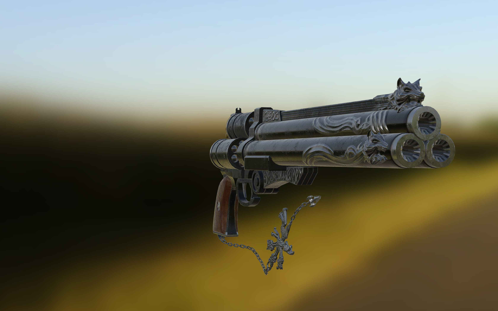
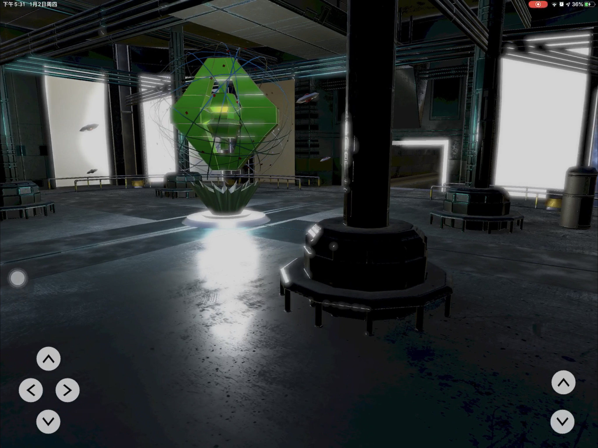
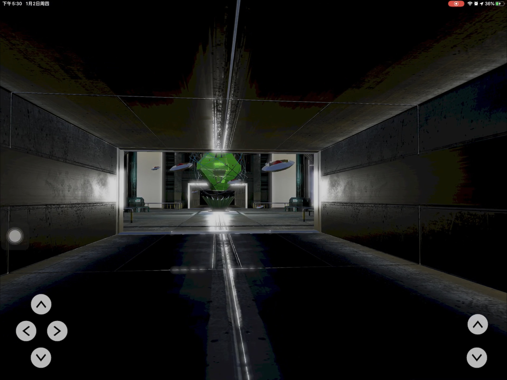
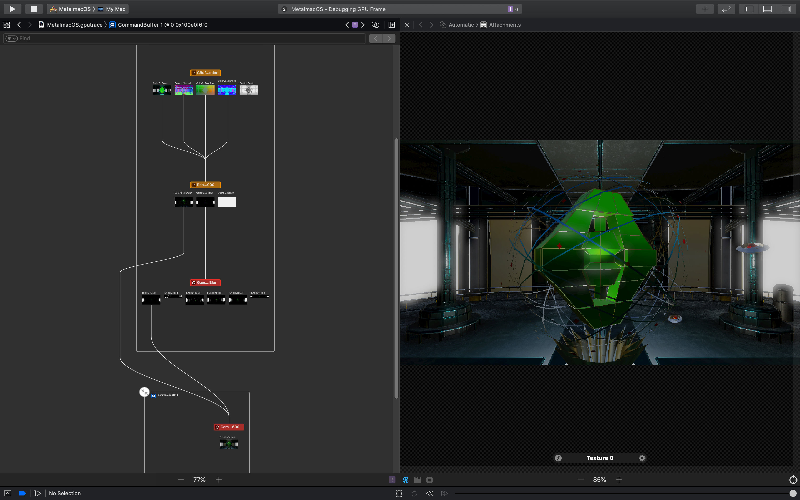

#  MetalRender

This is a metal-study project. The app renders a scene of a space station using some advanced rendering techniques such as PBR, deferred rendering.

## Screenshots

## References

[Space Station Scene HD](https://sketchfab.com/3d-models/space-station-scene-hd-854c32b570d8498fa0cca4fe3350ccf9) by 3DHaupt

[Gun](http://artisaverb.info/PBT.html) by Andrew Maximov

## One more thing

The assets are not included in this repo.
